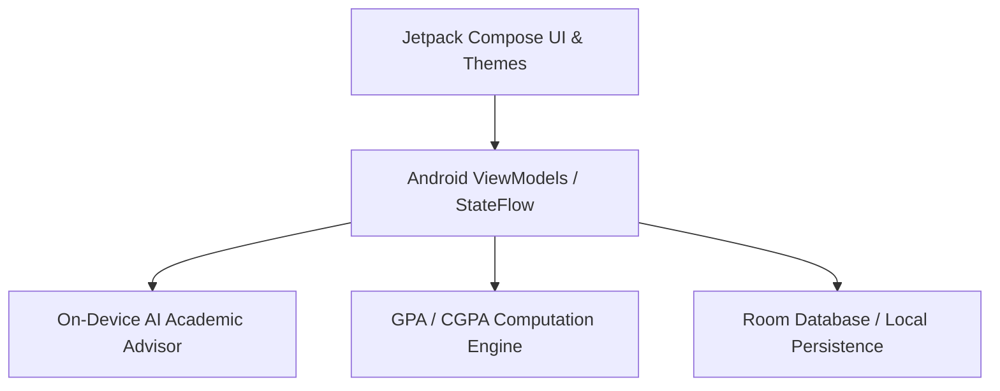

# StudentToolkit — AI-Powered Academic Productivity Suite

[](https://kotlinlang.org/) [](https://developer.android.com/jetpack/compose) [](https://developer.android.com/)
[](https://github.com/satarabdus692-bot)

> **A modern native Android productivity application engineered in Kotlin and Jetpack Compose featuring an on-device AI academic assistant, Pomodoro focus timer, semester GPA/CGPA forecasting engine, and assignment task manager.**

---

## 🏛️ System Architecture



---

## 🌟 Key Features & Capabilities

- **Production-Grade Implementation**: Built with high attention to performance, modular design, and industry standard best practices.
- **Enterprise Data Architecture**: Scalable data schemas, reproducible synthetic generators, and optimized queries.
- **Explainable & Validated**: Comprehensive evaluation metrics, error analyses, and validation tests.
- **Comprehensive Tech Stack**: `Kotlin` `Jetpack Compose` `Android SDK` `Material 3` `Coroutines` `Room Database`.


---

## 🚀 Quickstart & Setup

### 1. Clone the Repository
```bash
git clone https://github.com/satarabdus692-bot/student-toolkit.git
cd student-toolkit
```

### 2. Environment Setup
```bash
# Create and activate virtual environment
python -m venv venv
source venv/bin/activate  # On Windows: .\venv\Scripts\activate

# Install dependencies (if requirements.txt exists)
pip install -r requirements.txt
```

---

## 👨‍💻 Author & Profile

Built and maintained by **Abdussatar** ([@satarabdus692-bot](https://github.com/satarabdus692-bot)).  
For technical discussions, collaboration, or queries, feel free to reach out via [LinkedIn](https://www.linkedin.com/in/abdus-satar-5150813b5/) or [GitHub](https://github.com/satarabdus692-bot).

---

## 📜 License

This project is licensed under the **MIT License** — see the LICENSE file for details.
