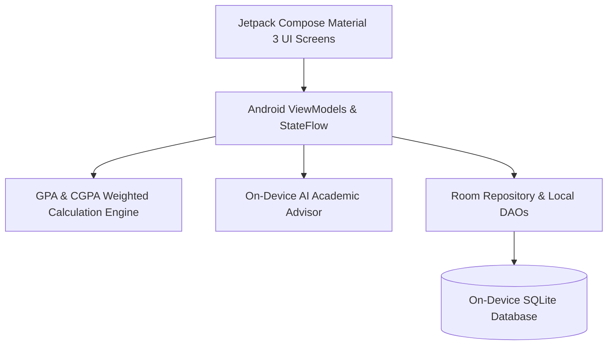

# StudentToolkit — Android Academic Productivity & GPA Forecasting Suite

<div align="center">

[](https://github.com/abdussatarkhan)
[](https://github.com/abdussatarkhan)
[](https://github.com/abdussatarkhan)

</div>

[](https://github.com/abdussatarkhan/student-toolkit/actions)
[](https://kotlinlang.org/)
[](https://developer.android.com/jetpack/compose)
[](https://developer.android.com/)
[](https://developer.android.com/training/data-storage/room)

> **A native Android academic productivity application engineered in Kotlin and Jetpack Compose featuring Material 3 theming, an on-device AI academic assistant, Pomodoro focus timer, semester GPA/CGPA forecasting engine, and assignment deadline organizer backed by Room SQLite database.**

---

## 🏛️ System Architecture



---

## 🌟 Key Features & Capabilities

- **📱 100% Native Jetpack Compose**: Modern declarative Android UI featuring dynamic Material Design 3 theming, fluid animations, and dark mode support.
- **🎓 Semester GPA / CGPA Forecasting**: Real-time grade point average computation supporting customizable university credit hour weighting systems and target grade simulations.
- **⏱️ Focus Pomodoro & Task Manager**: Integrated productivity timer with audible session alerts, priority assignment tracking, and exam countdowns.
- **🔒 Offline-First Room SQLite Persistence**: Robust local database architecture with Room DAOs and Kotlin Coroutines ensuring 100% offline availability with zero data leakage.

---

## 🚀 Quickstart & Setup

### Prerequisites
- [Android Studio Hedgehog (2023.1.1) or newer](https://developer.android.com/studio)
- Android SDK 34
- JDK 17+

### 1. Clone the Repository
```bash
git clone https://github.com/abdussatarkhan/student-toolkit.git
cd student-toolkit
```

### 2. Build the Project

**Option A: Using Android Studio**
1. Open Android Studio and select **Open**.
2. Select the cloned `student-toolkit` folder.
3. Allow Gradle to sync dependencies and click **Run (Shift+F10)** on an emulator or physical device.

**Option B: Using Gradle CLI**
```bash
# On Linux / macOS:
./gradlew assembleDebug

# On Windows:
.\gradlew.bat assembleDebug
```
The compiled APK will be located at `app/build/outputs/apk/debug/app-debug.apk`.

---

## 🖥️ Application & Operational Interface

<p align="center">
  
</p>

> [!TIP]
> You can also explore [`dashboard.html`](dashboard.html) directly in any modern browser for a standalone interface walkthrough.

---

## 🗺️ Roadmap & Upcoming Enhancements

- [x] Kotlin & Jetpack Compose modern Material 3 UI
- [x] Weighted GPA/CGPA computation engine
- [x] Local Room SQLite persistence for offline use
- [ ] Cloud backup and sync with Google Drive
- [ ] Class timetable schedule widget for Android Home Screen
- [ ] Push notification alerts for upcoming assignment deadlines

---

## 👨‍💻 Author & Contact

Built and maintained by **Abdussatar** ([@abdussatarkhan](https://github.com/abdussatarkhan)).  
For technical discussions, collaboration, or queries, feel free to reach out via [LinkedIn](https://www.linkedin.com/in/abdus-satar-5150813b5/) or [GitHub](https://github.com/abdussatarkhan).

---

## 📜 License

This project is licensed under the **MIT License** — see the LICENSE file for details.

---

<div align="center">

### 👨‍💻 Maintained by [Abdussatar (@abdussatarkhan)](https://github.com/abdussatarkhan)
Part of the **[Abdussatar Software Engineering & Systems Portfolio](https://github.com/abdussatarkhan)**.

⭐ If you find this project valuable, consider dropping a star! ⭐

</div>
